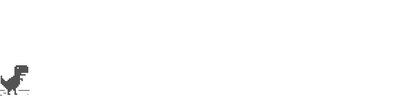

# Ai2 T-Rex Runner 🦕

A beautifully themed version of the classic Chrome T-Rex runner game featuring the Ai2 color palette. Play with a **bright pink T-Rex**, **mint green cacti**, and **purple pterodactyls** on a **dark teal background**!



## 🌈 Features

- **Custom Ai2 Theme**: Beautiful color scheme with:
  - 🦕 **Super Bright Pink T-Rex** (`#F0529C`)
  - 🌵 **Mint Green Cacti** (`#0FCBBC`) 
  - 🦅 **Purple Pterodactyls** (`#B11BE8`)
  - 🎨 **Dark Teal Background** (`#0A3235`)
  - ⚪ **White Horizon & Clouds** (`#FFFFFF`)

- **Iframe-Friendly**: Easily embeddable in other websites
- **Responsive Design**: Works on desktop and mobile devices
- **Touch Support**: Tap to jump on mobile devices
- **Sound Effects**: Classic game sounds included

## 🎮 How to Play

- **Space Bar** or **Up Arrow**: Jump
- **Down Arrow**: Duck (while running)
- **Enter**: Restart game (when crashed)
- **Touch/Click**: Jump (mobile/iframe support)

## 🌐 Live Demo

Play the game at: `https://[your-username].github.io/ai2-trex-runner/`

## 📦 GitHub Pages Deployment

This project is configured for automatic GitHub Pages deployment:

1. **Fork or clone this repository**
2. **Enable GitHub Pages** in repository settings:
   - Go to Settings > Pages
   - Source: Deploy from a branch
   - Branch: `main` (or `master`)
   - Folder: `/ (root)`
3. **Your game will be live** at `https://[username].github.io/ai2-trex-runner/`

## 🖼️ Iframe Embedding

Easily embed this game in your website:

```html
<iframe 
  src="https://[username].github.io/ai2-trex-runner/" 
  width="800" 
  height="400" 
  frameborder="0"
  title="Ai2 T-Rex Runner Game">
</iframe>
```

### Advanced Iframe Usage

The game includes iframe-friendly features:

```html
<iframe id="trex-game" 
  src="https://[username].github.io/ai2-trex-runner/" 
  width="100%" 
  height="400" 
  frameborder="0"
  allow="autoplay"
  title="Ai2 T-Rex Runner Game">
</iframe>

<script>
// Programmatically start the game
document.getElementById('trex-game').contentWindow.startTRexGame();
</script>
```

## 🛠️ Local Development

1. **Clone the repository:**
   ```bash
   git clone https://github.com/[username]/ai2-trex-runner.git
   cd ai2-trex-runner
   ```

2. **Serve locally** (any HTTP server works):
   ```bash
   # Python 3
   python -m http.server 8000
   
   # Python 2
   python -m SimpleHTTPServer 8000
   
   # Node.js
   npx serve .
   
   # VS Code Live Server extension
   # Right-click index.html > Open with Live Server
   ```

3. **Open** `http://localhost:8000` in your browser

## 📁 Project Structure

```
ai2-trex-runner/
├── index.html          # Main game page
├── index.css           # Game styles  
├── index.js            # Game logic & Ai2 theming
├── README.md           # This file
├── LICENSE             # MIT License
└── assets/             # Game assets
    ├── default_100_percent/
    │   ├── 100-disabled.png
    │   ├── 100-error-offline.png
    │   └── 100-offline-sprite.png
    └── default_200_percent/
        ├── 200-disabled.png
        ├── 200-error-offline.png
        └── 200-offline-sprite.png
```

## 🎨 Customization

### Color Theme

The Ai2 color palette can be modified in `index.js`:

```javascript
Runner.config = {
    // Color customization
    ENABLE_COLOR_FILTER: true,
    TREX_COLOR: '#F0529C',        // Pink T-Rex
    CACTUS_COLOR: '#0FCBBC',      // Mint Green Cacti  
    PTERODACTYL_COLOR: '#B11BE8', // Purple Pterodactyls
    BACKGROUND_COLOR: '#0A3235',  // Dark Teal Background
};
```

### Disabling Custom Colors

Set `ENABLE_COLOR_FILTER: false` to use original Chrome colors.

## 🤝 Contributing

1. Fork the repository
2. Create your feature branch (`git checkout -b feature/amazing-feature`)
3. Commit your changes (`git commit -m 'Add amazing feature'`)
4. Push to the branch (`git push origin feature/amazing-feature`)
5. Open a Pull Request

## 📜 License

This project is licensed under the MIT License - see the [LICENSE](LICENSE) file for details.

## 🙏 Acknowledgments

- Original Chrome T-Rex game by the Chromium team
- Ai2 color palette and theming
- Base64 encoded sound effects from the original game
- Sprite graphics from Chrome source code

## 🔗 Links

- [Live Demo](https://[username].github.io/ai2-trex-runner/)
- [Original Chrome T-Rex](chrome://dino/)
- [Ai2 Color Palette](https://appinventor.mit.edu/)

---

**Made with 💖 and the beautiful Ai2 color palette**
